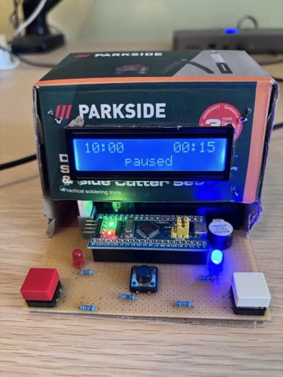

# Chess Clock using a STM33 microcontroller

This is my first little embedded project, a simple chess clock with configurable time keeping.

I've been playing chess with my son, with a smaller time allowance on my side as a handicap,
so that was the goal with this little product (and of course to build something physical after
all the software development).

